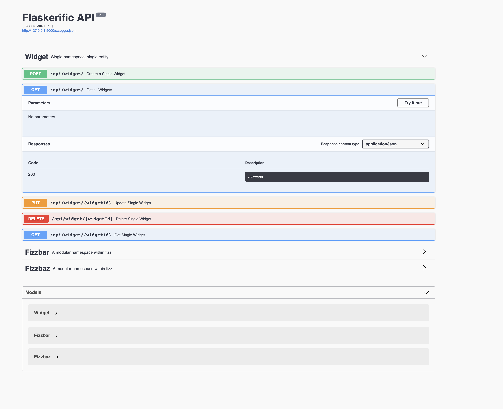

# Example of a scalable Flask API



A sample project showing how to build a scalable, maintainable, modular Flask API with a heavy emphasis on testing.

_This is an example project using the structure proposed in [this blog post](https://apryor6.github.io/2019-05-20-flask-api-example/)._


## Running the app

Preferably, first create a virtualenv and activate it, perhaps with the following command:

```
virtualenv -p python3 venv
source venv/bin/activate
```

Next, run

```
pip install -r requirements.txt
```

to get the dependencies.

Next, initialize the database

```
python manage.py seed_db
```

Type "Y" to accept the message (which is just there to prevent you accidentally deleting things -- it's just a local SQLite database)

Finally run the app with

```
python wsgi.py
```

Navigate to the posted URL in your terminal to be greeted with Swagger, where you can test out the API.


## Running tests

To run the test suite, simply pip install it and run from the root directory like so

```
pip install pytest
pytest
```

